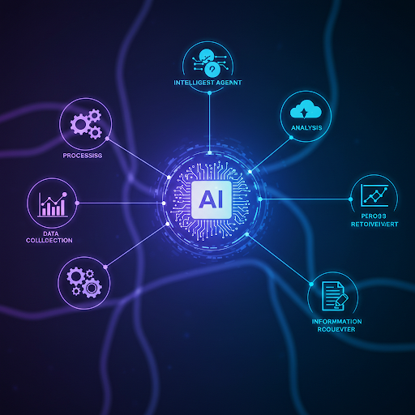

 
 
 

# Desarrollo de laboratorio de IA

## Agente de IA para atencion a clientes

Es un desarrollo de IA usando las herramientas de Google en inteligencia artificial para crear un 
agente de primera atención en donde podra atender desde una llamada hasta un mensaje con los contextos adecuados y presisos que se le proporcionene

## Inserción de Imágenes en Markdown

Para insertar una imagen en un archivo markdown, usa la siguiente sintaxis:

### DevTools

- Deno
- Google Cloude - generative-ia
- Google Cloude - speech
- Google Cloude - Text-to-speech

